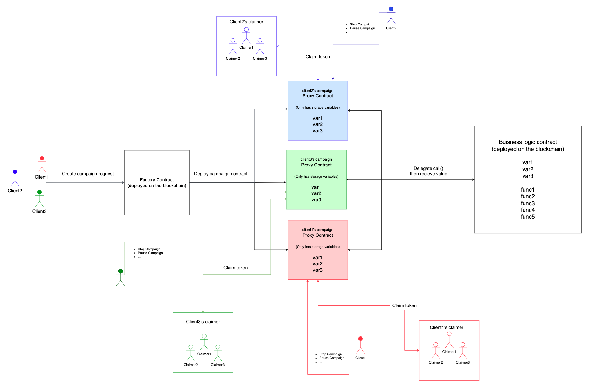

# [Drop The Bit]: Polygon BUIDL IT : Summer 2022 - Public Goods 부문 3위 수상작

- [프로젝트 소개 페이지](https://devpost.com/software/dropthebit)
- [공식 웹사이트](https://dropthebit.io/)

## Project Overview

"Drop The Bit"는 Native 코인 및 FT/NFT 토큰을 URL 링크를 통해 암호화폐에 익숙하지 않은 사용자들에게 쉽게 분배할 수 있는 유틸리티성 WEB3 소프트웨어입니다. 사용자는 캠페인을 생성하여 다양한 체인의 메인넷에서 코인, 토큰을 링크를 통해 손쉽게 이체할 수 있습니다. 이 프로젝트는 블록체인 게임 회사 및 토큰 프로젝트에 특히 유용하며, 실제 활용을 목표로 개발되었습니다.

본 저장소는 스마트 컨트랙트를 학습하는 개발자들을 위해, 학습 및 연구 목적으로 소스코드를 공개합니다.

## Implementation Details

### 개발 환경

- Solidity 0.8.17
- JavaScript
- Hardhat
- Ethers.js
- Chai

### 팩토리 컨트랙트 활용

- 팩토리 컨트랙트를 통한 프록시 컨트랙트 배포로 가스비 절감 및 배포 시간 단축.

### 비즈니스 로직 분리

- 유연한 업그레이드를 위한 비즈니스 로직과 스마트 컨트랙트의 분리.

### 리엔트랜시 공격 대응

- 리엔트랜시 공격 방지를 위한 Checks-Effects-Interactions 패턴 적용.

### 가스비 최적화

- error 및 revert를 통한 가스비 최적화: require() 대비 75% 가스비 절감.

### 가독성 향상

- 코드의 가독성과 유지 보수성 향상을 위한 Modify 패턴 적극 활용.

### EVM 계열 멀티체인 지원

- Ethereum, BSC, Polygon, Avalanche 등 다양한 EVM 호환 체인 지원.

### 테스트

- 하드햇 및 차이를 활용한 다양한 EVM 체인 환경에서의 광범위한 테스팅 완료.
